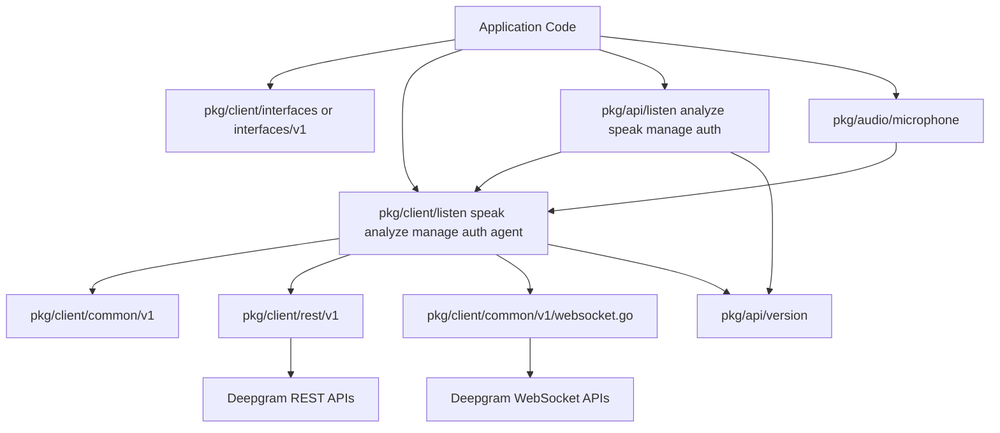
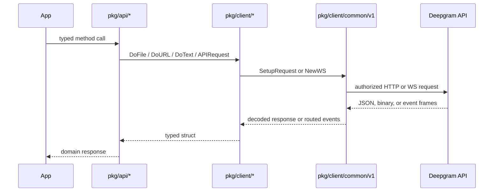

The SDK is intentionally layered. The outermost layer is the public package surface in `pkg/client/...` and `pkg/api/...`. Under that, shared transport code lives in `pkg/client/common/v1`, `pkg/client/rest/v1`, and `pkg/api/version`. Event routers live beside each WebSocket API package, while option structs and shared errors sit in `pkg/client/interfaces/v1`.

## Module Relationships

`pkg/client/interfaces/v1` defines the option and error types that every higher-level package consumes. `ClientOptions.Parse()` in `pkg/client/interfaces/v1/options.go` reads environment variables, resolves auth, and enables WebSocket flags like keepalive and auto-flush. The transport packages then consume those parsed options instead of re-implementing auth rules per feature.

`pkg/client/rest/v1/rest.go` is the low-level HTTP client. `pkg/client/common/v1/rest.go` adds Deepgram-specific headers, error decoding, and raw response handling. Feature packages like `pkg/client/listen/v1/rest/client.go` and `pkg/client/speak/v1/rest/client.go` only need to build the correct URI and request body.

The WebSocket side mirrors that pattern. `pkg/client/common/v1/websocket.go` owns connection setup, authorization headers, retry loops, TLS selection, and the background read loop. Product-specific clients such as `pkg/client/listen/v1/websocket/client_callback.go`, `pkg/client/speak/v1/websocket/client_channel.go`, and `pkg/client/agent/v1/websocket/client_channel.go` add message-specific commands like `Finalize()`, `Flush()`, or agent settings bootstrapping.

## Data Lifecycle

For REST APIs, a request starts with an API wrapper like `pkg/api/listen/v1/rest.Client.FromURL()`. That wrapper validates options, allocates a typed response struct, and delegates to a lower-level sender in `pkg/client/listen/v1/rest/client.go`. The transport then asks `pkg/api/version` to construct the endpoint URI, uses `common.RESTClient.SetupRequest()` to attach headers, and finally decodes either JSON or binary output with `HandleResponse()`.

For WebSockets, constructors such as `listen.NewWSUsingCallback()` or `speak.NewWSUsingChan()` assemble a router and `common.WSClient`. `common.WSClient.internalConnectWithCancel()` dials the socket, publishes an `Open` event, and starts a background `listen()` loop. Incoming frames are delegated to `ProcessMessage()`, which can inspect the message, auto-flush, and route payloads to callback interfaces or channel collections defined in the API interface packages.

## Key Design Decisions

### 1. Typed wrappers sit on top of transport clients

Files like `pkg/api/listen/v1/rest/rest.go` and `pkg/api/speak/v1/rest/speak.go` are intentionally thin. They convert generic transport calls into typed methods with domain-focused names. That keeps the reusable transport layer small while still giving application code ergonomic entry points.

### 2. Authentication is centralized

`ClientOptions.GetAuthToken()` and `ClientOptions.Parse()` in `pkg/client/interfaces/v1/types-client.go` and `pkg/client/interfaces/v1/options.go` implement one auth policy for the entire SDK: explicit bearer token first, explicit API key second, then environment variables. Because both REST and WebSocket clients call `options.Parse()`, the behavior is consistent across every product surface.

### 3. WebSocket delivery supports both callbacks and channels

Listen and Speak each expose callback-based and channel-based constructors. The router packages in `pkg/api/listen/v1/websocket` and `pkg/api/speak/v1/websocket` let the SDK support simple event handlers for lightweight apps and channel fan-out for more concurrent or pipeline-heavy applications. The trade-off is a larger API surface, but it avoids forcing every Go team into one concurrency pattern.

### 4. Voice Agent sends settings after connect

The Agent client is different from the listen and speak clients because its session configuration is sent as the first WebSocket message, not encoded into the URL. `pkg/client/agent/v1/websocket/client_channel.go` marshals `SettingsOptions`, removes empty provider maps, and writes the cleaned JSON after the socket opens. That matches the Voice Agent protocol and explains why `GetURL()` ignores the settings object.

## What Calls What

- `pkg/client/listen.NewRESTWithDefaults()` returns a REST transport client.
- `pkg/api/listen/v1/rest.New()` wraps that transport with `FromFile`, `FromStream`, and `FromURL`.
- `pkg/client/listen.NewWSUsingCallback()` or `NewWSUsingChan()` create realtime speech clients with either callback or channel routing.
- `pkg/client/speak.NewRESTWithDefaults()` plus `pkg/api/speak/v1/rest.New()` handle file, writer, or raw-buffer TTS output.
- `pkg/client/manage.NewWithDefaults()` plus `pkg/api/manage/v1.New()` expose project, key, invite, usage, billing, and model management methods.

The result is a codebase that shares auth and transport machinery aggressively while keeping each product surface typed and discoverable.
