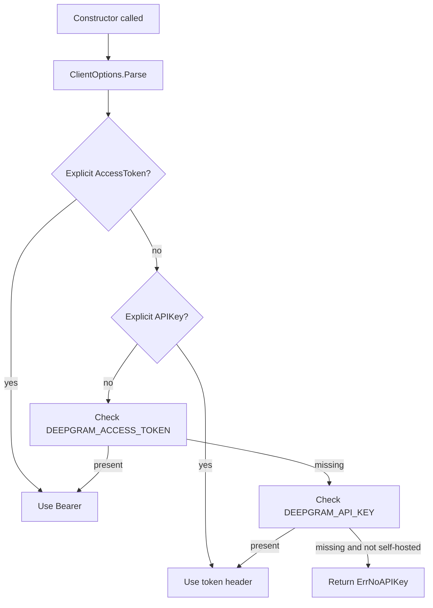

Authentication and client options are the first concept to understand because every REST and WebSocket constructor depends on them. The central type is `pkg/client/interfaces.ClientOptions`, which aliases `pkg/client/interfaces/v1.ClientOptions`. Its parsing and token-selection logic lives in `pkg/client/interfaces/v1/options.go` and `pkg/client/interfaces/v1/types-client.go`.

## What This Concept Solves

Without a shared option object, every client package would need its own rules for host overrides, version selection, proxy support, and auth headers. The SDK avoids that duplication by making `ClientOptions` the single source of truth for credential priority and shared transport behavior.

## How It Relates To Other Concepts

- The typed API layer depends on already-configured transport clients.
- Realtime streaming relies on `EnableKeepAlive`, `RedirectService`, and auto-flush fields from `ClientOptions`.
- Voice Agent, Listen, Speak, Manage, and Auth all call `options.Parse()` during construction.

## How It Works Internally

`ClientOptions.Parse()` first resolves credentials in a fixed order: explicit `AccessToken`, explicit `APIKey`, `DEEPGRAM_ACCESS_TOKEN`, then `DEEPGRAM_API_KEY`. It also reads `DEEPGRAM_HOST`, `DEEPGRAM_API_VERSION`, `DEEPGRAM_API_PATH`, `DEEPGRAM_SELF_HOSTED`, and several WebSocket-specific flags. The token getters and setters are protected by a mutex in `pkg/client/interfaces/v1/types-client.go`, so the auth material can be swapped safely in long-lived processes.

REST clients consume those options through `pkg/client/common/v1/rest.go`. `SetupRequest()` calls `GetAuthToken()` and emits `Authorization: Bearer ...` when an access token is active, otherwise `Authorization: token ...`. The same logic is reused in `pkg/client/common/v1/websocket.go` before dialing a socket, which is why the auth model is identical for HTTP and streaming.



## Basic Usage

```go
package main

import (
  "context"

  api "github.com/deepgram/deepgram-go-sdk/v3/pkg/api/listen/v1/rest"
  client "github.com/deepgram/deepgram-go-sdk/v3/pkg/client/listen"
  interfaces "github.com/deepgram/deepgram-go-sdk/v3/pkg/client/interfaces"
)

func main() {
  ctx := context.Background()

  c := client.NewREST("", &interfaces.ClientOptions{
    Host: "https://api.deepgram.com",
  })

  dg := api.New(c)
  _, _ = dg.FromURL(ctx, "https://dpgr.am/spacewalk.wav", nil)
}
```

## Advanced Usage

This pattern mirrors the behavior shown in `examples/auth/grant-token/main.go`: mint a bearer token once, then switch clients over without rebuilding the rest of your app.

```go
package main

import (
  "context"

  authAPI "github.com/deepgram/deepgram-go-sdk/v3/pkg/api/auth/v1"
  authClient "github.com/deepgram/deepgram-go-sdk/v3/pkg/client/auth"
  interfaces "github.com/deepgram/deepgram-go-sdk/v3/pkg/client/interfaces/v1"
)

func main() {
  ctx := context.Background()

  opts := &interfaces.ClientOptions{}
  tokenClient := authAPI.New(authClient.NewWithDefaults())
  tokenResp, err := tokenClient.GrantToken(ctx, nil)
  if err != nil {
    panic(err)
  }

  opts.SetAccessToken(tokenResp.AccessToken)
  token, isBearer := opts.GetAuthToken()
  _, _ = token, isBearer
}
```

<Callout type="warn">
If you pass an empty API key and also forget to set `DEEPGRAM_API_KEY` or `DEEPGRAM_ACCESS_TOKEN`, constructors return `nil` after `options.Parse()` fails. That means the first panic often appears later, when code dereferences the client. Validate the constructor result immediately in setup code.
</Callout>

<Accordions>
<Accordion title="Bearer tokens vs API keys">
Bearer tokens take priority because they are designed for delegated or short-lived access, while API keys are the broader credential of record. In practice, that means you can keep an API key in a secure backend service, mint short TTL tokens with `pkg/api/auth/v1.Client.GrantToken`, and hand those to user-facing or temporary workloads. The trade-off is operational complexity: token refresh has to be managed, and expired tokens fail harder in long-running workers. If you do not need delegated auth, using an API key directly is simpler.

```go
opts := &interfaces.ClientOptions{AccessToken: token}
```
</Accordion>
<Accordion title="Environment-driven config vs explicit config">
Environment variables are convenient because `ClientOptions.Parse()` will hydrate host, version, path, and auth without repeated boilerplate. That keeps examples and CLI-style apps clean, especially with `NewWithDefaults()` constructors. The downside is reduced local clarity: a reader cannot tell which host or token source is active without inspecting the process environment. For services with multiple Deepgram targets or auth modes, explicit `ClientOptions` values are easier to audit.

```go
opts := &interfaces.ClientOptions{Host: "https://api.deepgram.com"}
```
</Accordion>
<Accordion title="Dynamic credential switching">
The SDK supports `SetAccessToken` and `SetAPIKey`, and the fields are mutex-protected, so switching credentials at runtime is safe from a data-race perspective. That is useful when a long-lived process starts with an API key, requests a bearer token, and then rotates over to the shorter-lived credential. The trade-off is mental overhead: if many goroutines share one options object, your auth behavior becomes stateful. Prefer one credential strategy per client unless live rotation is a hard requirement.

```go
opts.SetAccessToken(newToken)
opts.SetAPIKey("")
```
</Accordion>
</Accordions>
