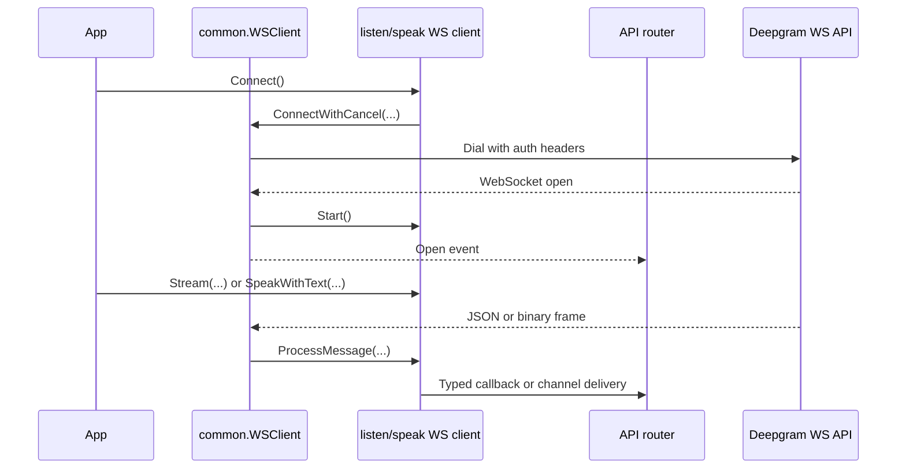

Realtime streaming is the most stateful part of the SDK. The listen and speak clients both build on `pkg/client/common/v1/websocket.go`, which owns connection retries, authorization headers, TLS configuration, the background read loop, and stop behavior. Product-specific packages then add message routing and protocol commands.

## What This Concept Is

For speech-to-text, you construct either a callback client or a channel client from `pkg/client/listen`. For text-to-speech, you do the same through `pkg/client/speak`. Each client wraps a shared `common.WSClient` plus a router from `pkg/api/listen/v1/websocket` or `pkg/api/speak/v1/websocket`.

## Why It Exists

Deepgram's realtime APIs are event streams, not one-shot RPC calls. You need a durable connection object that can dial, receive typed events, send control frames like keepalive or flush, and stream binary payloads in both directions. The SDK packages that lifecycle into concrete client types so applications can focus on the event logic.

## How It Relates To Other Concepts

- `ClientOptions` controls keepalive, redirect behavior, proxy settings, and auto-flush.
- Event types and callback/channel contracts live in the `pkg/api/.../websocket/interfaces` packages.
- The microphone helper in `pkg/audio/microphone` plugs into speech-to-text because the listen WebSocket clients implement `io.Writer`.

## How It Works Internally

`common.NewWS()` in `pkg/client/common/v1/websocket.go` stores the context, retry state, router, and handler object. When you call `Connect()`, `internalConnectWithCancel()` builds the auth headers, asks the feature client for the correct WebSocket URL through `GetURL()`, and dials the socket. After a successful handshake it starts a background `listen()` goroutine and then calls the feature client's `Start()` hook.

For listen WebSockets, `Start()` may launch `ping()` and `flush()` goroutines depending on `EnableKeepAlive` and `AutoFlushReplyDelta`. Incoming JSON messages are inspected in `inspect()` when auto-flush is enabled, then handed to the message router. For speak WebSockets, the flow is similar, but the public commands are `SpeakWithText`, `Flush`, and `Reset`, and incoming binary frames carry the synthesized audio.



## Basic Usage

This pattern matches the repo's callback example in `examples/speech-to-text/websocket/microphone_callback/main.go`.

```go
ctx := context.Background()

dg, err := listen.NewWSUsingCallback(ctx, "", &interfaces.ClientOptions{
  EnableKeepAlive: true,
}, &interfaces.LiveTranscriptionOptions{
  Model:          "nova-3",
  Language:       "en-US",
  Encoding:       "linear16",
  SampleRate:     16000,
  InterimResults: true,
  UtteranceEndMs: "1000",
}, callback)
if err != nil {
  panic(err)
}

if !dg.Connect() {
  panic("connect failed")
}
defer dg.Stop()
```

## Advanced Usage

Auto-flush is controlled entirely by `ClientOptions.AutoFlushReplyDelta` for listen and `ClientOptions.AutoFlushSpeakDelta` for speak. When enabled, the client inspects each message and emits finalization logic automatically.

```go
ctx := context.Background()

dg, err := speak.NewWSUsingChan(ctx, "", &interfaces.ClientOptions{
  AutoFlushSpeakDelta: 750,
}, &interfaces.WSSpeakOptions{
  Model:      "aura-2-thalia-en",
  Encoding:   "linear16",
  SampleRate: 48000,
}, chans)
if err != nil {
  panic(err)
}

if dg.Connect() {
  _ = dg.SpeakWithText("Chunk one.")
  _ = dg.SpeakWithText("Chunk two.")
}
```

<Callout type="warn">
`Connect()` returns `bool`, not `error`. If it returns `false`, the connection never became usable and no later streaming call will fix that. Treat a failed connect as a hard setup failure and recreate the client or call an explicit reconnect method.
</Callout>

<Accordions>
<Accordion title="Callbacks vs channels">
Callbacks are the lighter abstraction and are usually easier to wire into a small service or CLI. They keep event handling close to the client and reduce the number of goroutines and channel plumbing you have to own. Channels are more flexible when you want to fan events out to multiple workers or keep transport and business logic in separate goroutines. The cost of the channel model is more ceremony: you must implement the full event-channel interface, even if you only care about a few event types.

```go
dg, _ := listen.NewWSUsingCallback(ctx, "", cOptions, tOptions, callback)
```
</Accordion>
<Accordion title="Manual finalization vs auto-flush">
Manual `Finalize()` and `Flush()` calls give you the most predictable protocol control because your application decides exactly when a chunk or utterance is complete. Auto-flush reduces boilerplate and can work well for conversational flows, but it depends on message inspection and timing thresholds. That makes it more sensitive to latency, silence gaps, and model behavior. Use manual control in deterministic pipelines and auto-flush when you want the SDK to optimize interactive sessions.

```go
_ = dg.Finalize()
_ = dg.Flush()
```
</Accordion>
<Accordion title="Reusing a client vs recreating one">
The SDK includes `AttemptReconnect` methods, but these clients still represent live session state, including routing and timing data like `lastDatagram`. Reusing a client is cheaper and can preserve application wiring, especially when transient network failures occur. Recreating a client is simpler when you need to swap options, event handlers, or credentials in a controlled way. Prefer reconnect for transport interruptions and reconstruction for major session changes.

```go
ok := dg.AttemptReconnect(ctx, 5)
```
</Accordion>
</Accordions>
