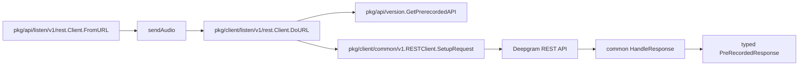

The Deepgram Go SDK exposes two complementary public layers. `pkg/client/...` gives you transport-aware clients that know how to authenticate, connect, retry, and stream. `pkg/api/...` wraps those clients with typed methods and response structs. Understanding that split prevents a lot of confusion when browsing the repo.

## What This Concept Is

The transport layer is the machinery. The API layer is the ergonomic surface. For example, `pkg/client/listen/v1/rest.Client` exposes `DoFile`, `DoStream`, and `DoURL`, while `pkg/api/listen/v1/rest.Client` exposes `FromFile`, `FromStream`, and `FromURL` returning `*PreRecordedResponse`. The same pattern appears in `pkg/client/analyze/v1/client.go` plus `pkg/api/analyze/v1/analyze.go`, and in `pkg/client/speak/v1/rest/client.go` plus `pkg/api/speak/v1/rest/speak.go`.

## Why It Exists

This pattern prevents the transport code from depending on product-specific response structs while still giving application authors typed, domain-friendly methods. It also makes it easier for the SDK to share common request setup and error handling across multiple products.

## How It Relates To Other Concepts

- Authentication is resolved before the transport is constructed.
- Realtime clients still use the same split, but with event interfaces instead of REST response structs.
- Guides in this documentation usually recommend the `pkg/api/...` wrappers unless you intentionally need lower-level control.

## How It Works Internally

Take the prerecorded speech flow as the simplest example. `pkg/api/listen/v1/rest.Client.FromURL()` creates a closure around the transport sender and passes it to `sendAudio()`. That helper validates `PreRecordedTranscriptionOptions`, allocates a typed `PreRecordedResponse`, and handles `StatusError` reporting. The lower-level transport in `pkg/client/listen/v1/rest/client.go` then builds the URI through `pkg/api/version.GetPrerecordedAPI`, creates the HTTP request, and decodes the body through `common.RESTClient.HandleResponse()`.

Speak REST follows the same pattern with an important twist: the transport returns header values like `request-id` and `model-name`, and `pkg/api/speak/v1/rest/speak.go` converts those into a typed `SpeakResponse`. That is why `DoText()` returns `(map[string]string, error)` while `ToSave()` returns `(*SpeakResponse, error)`.



## Basic Usage

Use the API wrapper when you want typed responses immediately.

```go
package main

import (
  "context"

  api "github.com/deepgram/deepgram-go-sdk/v3/pkg/api/analyze/v1"
  client "github.com/deepgram/deepgram-go-sdk/v3/pkg/client/analyze"
  interfaces "github.com/deepgram/deepgram-go-sdk/v3/pkg/client/interfaces"
)

func main() {
  ctx := context.Background()
  dg := api.New(client.NewWithDefaults())
  _, _ = dg.FromFile(ctx, "conversation.txt", &interfaces.AnalyzeOptions{
    Summarize: true,
    Topics:    true,
  })
}
```

## Advanced Usage

Use the transport layer directly when you want raw control over where decoded data lands.

```go
package main

import (
  "bytes"
  "context"

  client "github.com/deepgram/deepgram-go-sdk/v3/pkg/client/speak/v1/rest"
  interfaces "github.com/deepgram/deepgram-go-sdk/v3/pkg/client/interfaces/v1"
)

func main() {
  ctx := context.Background()
  buf := &bytes.Buffer{}

  c := client.NewWithDefaults()
  _, _ = c.DoText(ctx, "Hello from Deepgram", &interfaces.SpeakOptions{
    Model:      "aura-2-thalia-en",
    Encoding:   "linear16",
    SampleRate: 48000,
  }, []string{"request-id", "model-name"}, buf)
}
```

<Callout type="warn">
Do not mix the response structs from one layer with the client from another by guesswork. For example, `pkg/client/listen/v1/rest.Client` does not promise to return `*PreRecordedResponse`; that contract belongs to `pkg/api/listen/v1/rest.Client`. If you use the transport directly, you are responsible for the destination type.
</Callout>

<Accordions>
<Accordion title="Why not expose only the typed API layer">
A single typed layer would be simpler to explain, but it would force product-specific dependencies into every transport path and make binary or raw response handling awkward. The current split lets `pkg/client/common/v1` stay reusable for JSON bodies, writers, and raw buffers without importing every response model package. That matters most for TTS, where the response body is audio and the metadata lives in headers. The trade-off is discoverability: new users have to learn that `pkg/client/...` and `pkg/api/...` are both public.

```go
dg := api.New(client.NewRESTWithDefaults())
```
</Accordion>
<Accordion title="When to use the transport layer directly">
Direct transport usage makes sense when you need custom decoding, want to stream into an `io.Writer`, or need to intercept headers before wrapping them into a domain struct. The speak transport is the clearest example because it can write audio straight into a buffer, file, or arbitrary writer. The downside is more boilerplate and weaker type guarantees in application code. For most integrations, the API layer is the right default.

```go
var raw interfaces.RawResponse
```
</Accordion>
<Accordion title="Versioned packages and aliases">
The SDK keeps versioned implementation packages like `pkg/client/analyze/v1` and also exposes stable entry points such as `pkg/client/analyze`. That keeps room for future breaking package revisions without forcing immediate import churn for every consumer. The price is extra aliases and indirection when reading the source. If you want the least surprise in docs and code review, prefer the top-level package import unless a page explicitly documents a versioned package.

```go
import client "github.com/deepgram/deepgram-go-sdk/v3/pkg/client/analyze"
```
</Accordion>
</Accordions>
