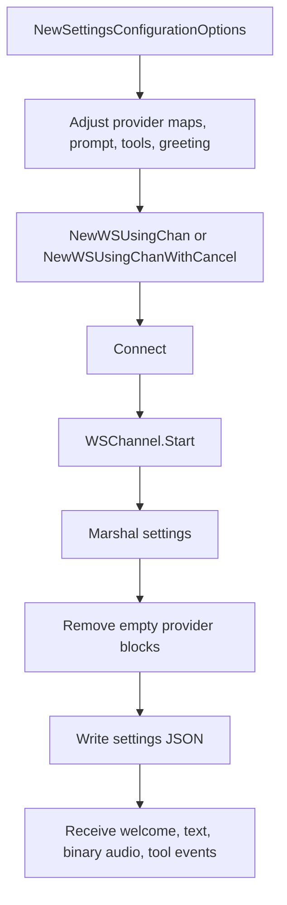

The Voice Agent client is the most protocol-specific surface in the SDK. Unlike listen and speak, it does not encode most session behavior into query parameters. Instead, it sends a structured settings payload immediately after the WebSocket opens.

## What This Concept Is

`pkg/client/agent.NewSettingsConfigurationOptions()` returns a pre-populated `*interfaces.SettingsOptions` object. That object includes audio input and output defaults plus Deepgram, OpenAI, and Aura provider defaults created in `pkg/client/interfaces/v1/options.go`. The agent WebSocket client then serializes those settings after connection and routes a wider event set than the other streaming clients.

## Why It Exists

Voice Agent sessions combine STT, LLM reasoning, TTS, and optional function/tool invocation in one stream. A simple query-string model is not expressive enough for that. The settings payload gives the server one structured message describing how the agent should listen, think, speak, and call tools.

## How It Relates To Other Concepts

- It still depends on the same `ClientOptions` auth model as the rest of the SDK.
- It reuses the shared WebSocket transport in `pkg/client/common/v1/websocket.go`.
- Its response and channel types live in `pkg/api/agent/v1/websocket/interfaces`.

## How It Works Internally

The `WSChannel.Start()` method in `pkg/client/agent/v1/websocket/client_channel.go` is the key file. After connect, it marshals `SettingsOptions`, clones the payload into a generic map, removes empty nested provider maps through `deleteEmptyProvider()`, and writes the cleaned object over the socket. Only then does it start the keepalive goroutine when configured.

That cleanup step matters. The default settings constructor creates nested provider maps, but agent sessions can override or omit parts of `listen`, `think`, or `speak`. Sending empty provider objects would create ambiguous payloads, so the client strips them before transmission. This is one of the clearest examples in the repo where the SDK adapts a Go configuration object to match a more opinionated wire protocol.



## Basic Usage

```go
ctx := context.Background()

settings := agent.NewSettingsConfigurationOptions()
settings.Agent.Greeting = "Hello, how can I help today?"
settings.Agent.Listen.Provider["model"] = "nova-3"

dg, err := agent.NewWSUsingChan(ctx, "", &interfaces.ClientOptions{
  EnableKeepAlive: true,
}, settings, chans)
if err != nil {
  panic(err)
}

if !dg.Connect() {
  panic("connect failed")
}
```

## Advanced Usage

This example reflects the provider-flexible structure introduced in the v3 line.

```go
settings := agent.NewSettingsConfigurationOptions()
settings.Experimental = true
settings.Agent.Think.Provider = map[string]interface{}{
  "type":  "open_ai",
  "model": "gpt-4o-mini",
}
settings.Agent.Speak.Provider = map[string]interface{}{
  "type":  "deepgram",
  "model": "aura-2-thalia-en",
}
settings.Agent.Think.Functions = &[]interfaces.Functions{
  {
    Name:        "lookup_order",
    Description: "Return the current order status",
    Endpoint: interfaces.Endpoint{
      Url:    "https://example.internal/orders",
      Method: "POST",
    },
  },
}
```

<Callout type="warn">
Agent settings are sent when the connection starts, so mutating the same `SettingsOptions` object after `Connect()` does not automatically reconfigure the running session. If you need to change prompt or speak behavior during a session, use the agent message types such as `UpdatePrompt`, `UpdateSpeak`, `InjectAgentMessage`, or `FunctionCallResponse` defined in `pkg/api/agent/v1/websocket/interfaces/types.go`.
</Callout>

<Accordions>
<Accordion title="Default settings vs explicit provider payloads">
The default settings constructor is useful because it gives you a working English-language agent with sensible audio formats and reference provider values. That reduces setup time and makes small experiments much faster. The trade-off is implicit behavior: if you never inspect the resulting object, you may not realize that `nova-3`, `gpt-4o-mini`, and `aura-2-thalia-en` were selected. In production, it is usually better to start from the defaults and then overwrite every provider value you care about explicitly.

```go
settings := agent.NewSettingsConfigurationOptions()
settings.Agent.Speak.Provider["model"] = "aura-2-thalia-en"
```
</Accordion>
<Accordion title="Channel routing for agents">
The agent client only exposes a channel-oriented public constructor surface in `pkg/client/agent/client.go`. That fits the protocol because Voice Agent sessions can emit text events, binary audio, keepalive acknowledgements, tool calls, and refusal notices that different goroutines may want to process independently. The cost is interface size: implementing `AgentMessageChan` is noticeably more work than a simple callback type. If you want simpler application code, wrap your channel handler in a small adapter that forwards only the events you care about.

```go
dg, _ := agent.NewWSUsingChan(ctx, "", cOptions, settings, chans)
```
</Accordion>
<Accordion title="Session boot payloads vs URL parameters">
Sending settings as a message keeps the connection URL stable and lets the SDK serialize nested structures like function schemas and provider maps cleanly. That is a better fit for agent sessions than trying to encode everything into query parameters. The trade-off is one extra protocol phase after connect: the socket may be open before the session is truly configured. If your app starts streaming audio immediately, make sure your event handling accounts for the `SettingsAppliedResponse` and welcome events.

```go
type SettingsAppliedResponse struct { Type string }
```
</Accordion>
</Accordions>
